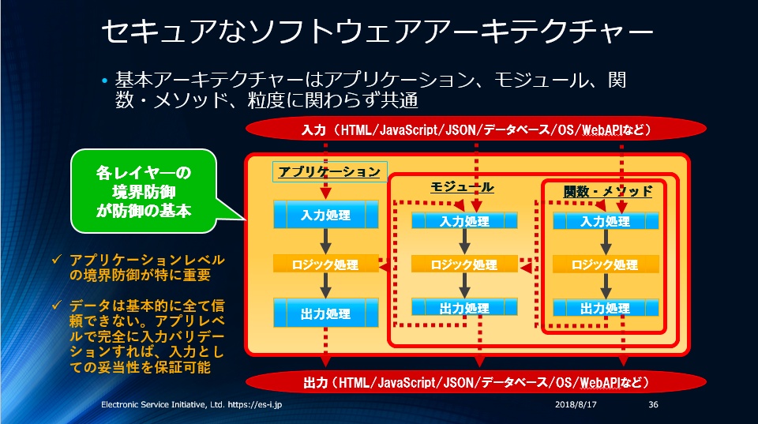
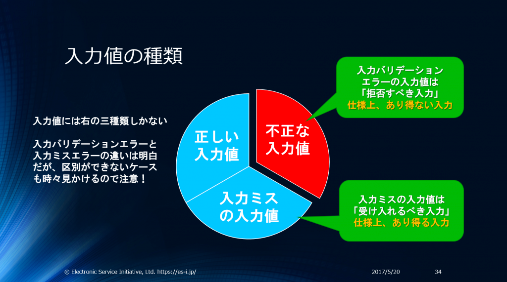

# CERT TOP10 tips(https://blog.ohgaki.net/cert-top-10-secure-coding-standard)
1. **入力をバリデーションする** 全ての信頼できないデータソースからの入力をバリデーションする。適切な入力バリデーションは非常に多くのソフトウェア脆弱性を排除できる。ほぼ全ての外部データソースに用心が必要である。これらにはコマンドライン引数、ネットワークインターフェース、環境変数やユーザーが制御可能なファイルなどが含まれる。
2. **コンパイラの警告に用心する** コードはコンパイラが利用可能な最も高い警告レベルでコンパイルし、コードを修正して警告を排除する。他のセキュリティ問題を発見、排除するために静的／動的な分析ツールを利用する。
3. **セキュリティポリシーの為に構成／設計する** ソフトウェアの構造と設計はソフトウェアがセキュリティポリシーを実装／強制するよう作る。例えば、システムが異る権限を異る場合に必要とするなら、システムをそれぞれ適切な権限で動作する独立したサブシステムに分離し通信させることを検討する。
4. **簡易にする** 可能な限り設計を簡単かつ小くする。複雑な設計はエラー発生の可能性を劇的に増やし、セキュリティ対策もより複雑化する。
5. **デフォルトで拒否する** アクセスを許可することを基本とし、排除は行わない。これは、デフォルトでアクセスを拒否し、保護設定でどのような条件下でアクセスを許可するか識別することを意味する。
   （訳注：一言で言うと、ホワイトリストを使いなさい、です）
6. **最小権限の原則を支持する** 全てのプロセスは仕事を完遂するために必要とされる最小限の権限で実行する。あらゆる権限昇格は最小限の期間に留める。このアプローチは攻撃者が昇格した権限で任意コードを実行する機会を最小限に留める。
7. **他のシステムに送信するデータを無害化する** コマンドシェル、リレーショナルデータベースや商用製品コンポーネントなどの複雑なシステムへの渡すデータは全て無害化する。 攻撃者はこれらのコンポーネントに対してSQL、コマンドやその他のインジェクション攻撃を用い、本来利用してない機能を実行できることがある。 これらは入力バリデーションの問題であるとは限らない。これは複雑なシステム機能の呼び出しがどのコンテクストで呼び出されたか入力バリデーションでは判別できないからである。 これらの複雑なシステムを呼び出す側は出力コンテクストを判別できるので、データの無害化はサブシステムを呼び出す前の処理が責任を持つ。 
   （訳注：入力対策と出力対策は独立した対策だが、90年代までの古いプログラミング原則である”重複した同じ処理は作らない”を今でも原則だと勘違いしているケースが少なくない。）
8. **縦深防御を実践する** リスクは複数の防御的戦略によって管理する。これは１つの防御層が不適切だったとしても、他の防御層がセキュリティ問題が攻撃可能な脆弱性なることを防いだり、成功した攻撃の結果を緩和できるからである。 例えば、セキュアプログラミング技術とセキュア実行環境の組み合わせは開発時にコード内に残った脆弱性を運用環境で攻撃される可能性を軽減できる。
   （訳注：縦深防御とは多層防御／多重のセキュリティとも呼ばれています）
9. **効果的な品質保証テクニックを利用する** 良い品質保証テクニックは脆弱性を識別／排除するために効果的である。 ファジングテスト、侵入テストおよびソースコード検査、これら全ては効果的な品質保証プログラムの共通要素である。独立したセキュリティレビューはよりセキュアなシステムを可能にする。 外部のレビューワーは、例えば無効な仮定の発見と修正など、独立した観点を持ち込む。
10. **セキュアコーディング標準を採用する** 利用する開発言語とプラットフォーム用のセキュアコーディング標準を開発／適用する。 
    （訳注：”セキュアコーディング標準”はただ利用するだけのモノではない。CERTがCやJava用に作っているいるようなセキュアコーディング標準を自分の開発環境／開発標準に合わせて作る。）

# バリデーション(https://blog.ohgaki.net/there-are-3-types-of-validations)
* バリデーションには3つ種類がある
  * 入力バリデーション – 正しく動作する為に必須（主に形式検証） 
  * ロジックバリデーション – 正しく動作する為に必須（主に論理検証） 
  * 出力バリデーション –  大半が上の2つに失敗した場合のフェイルセーフ対策（つまり入力やロジックのバリデーションを通ってしまったものを出力する際に念の為バリデーションを貼っているかんじ）
    フェイルセーフ対策とは機器やシステムの設計などについての考え方の一つで、部品の故障や破損、操作ミス、誤作動などが発生した際に、なるべく安全な状態に移行するような仕組みにしておくこと。 
  
   